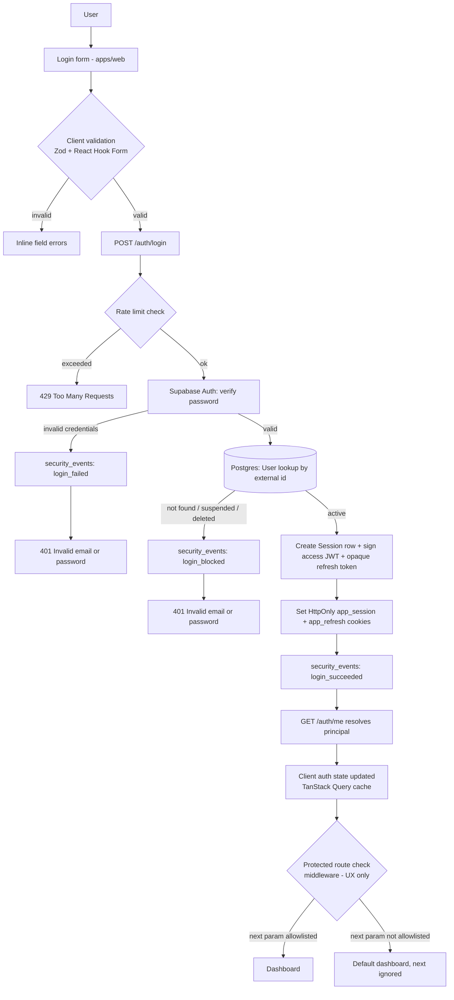
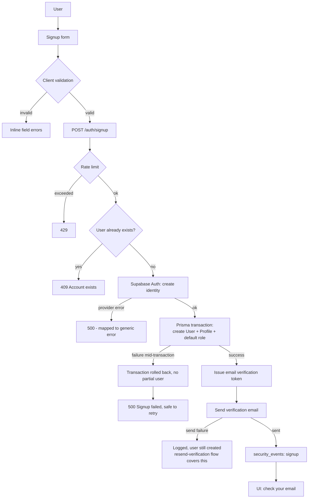
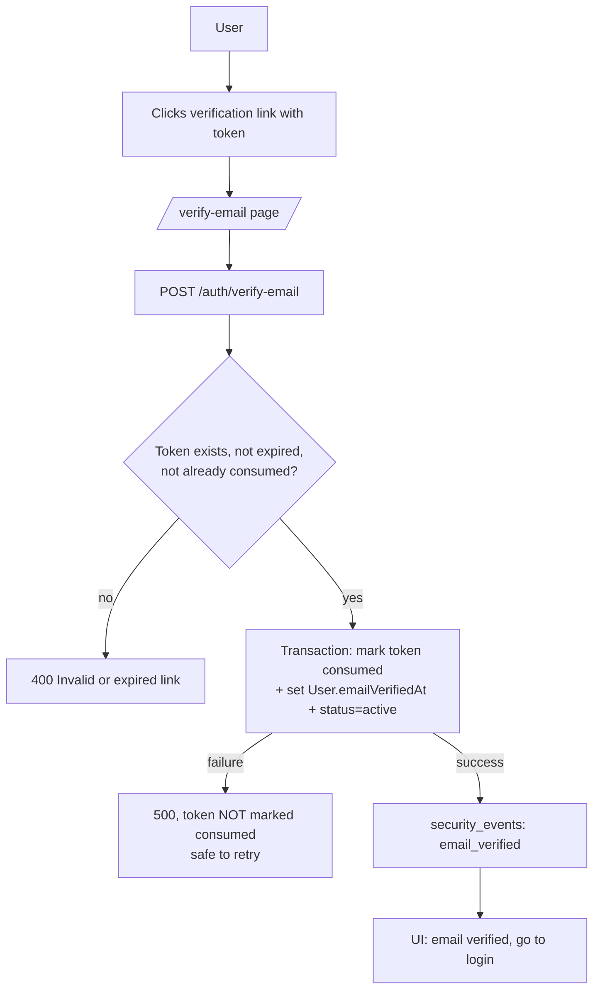
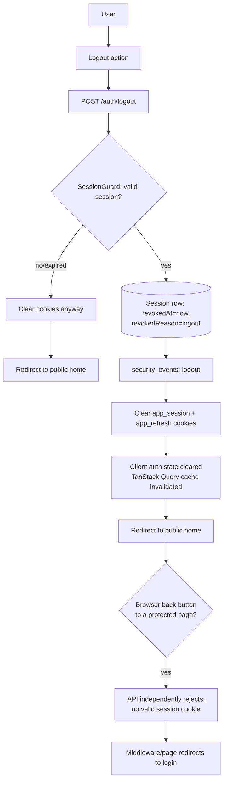
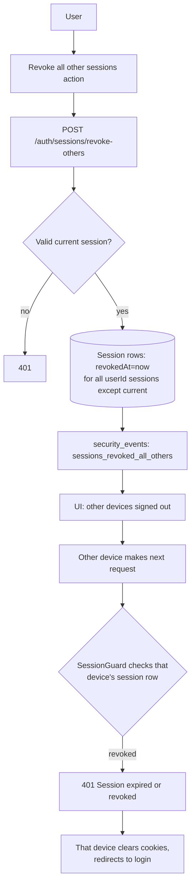
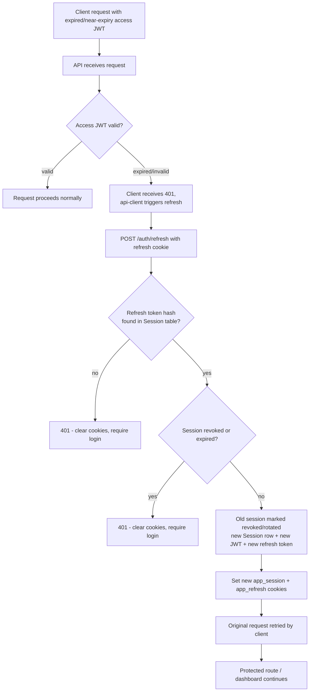
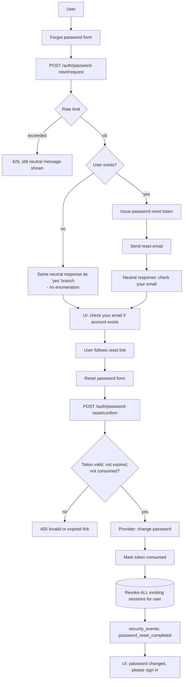
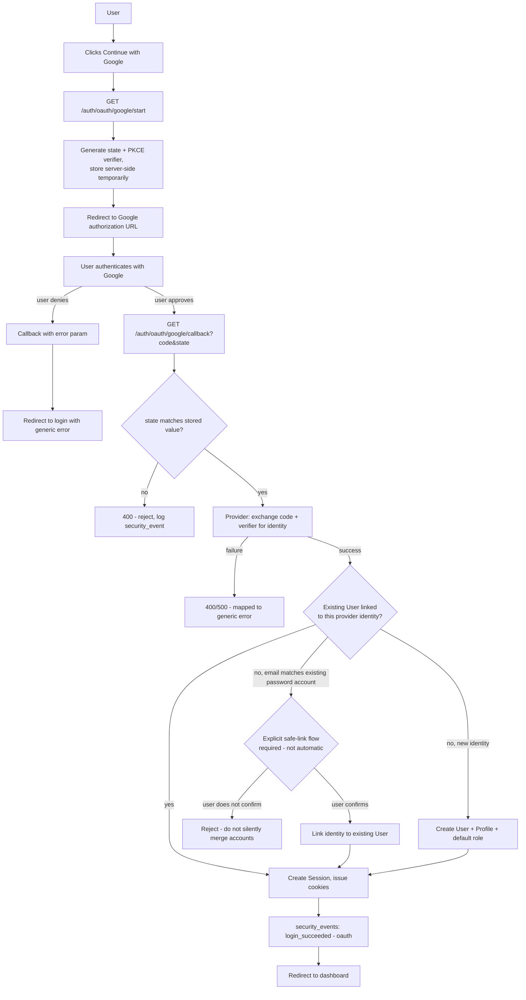
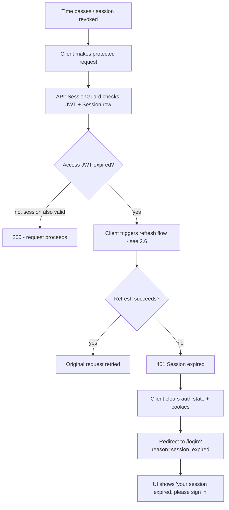
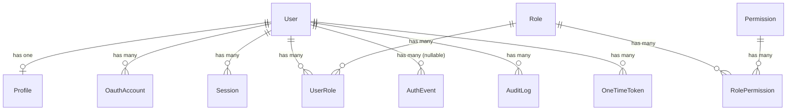

# docs/auth/ARCHITECTURE.md

Phase 1 deliverable. This document defines the architecture, lifecycle diagrams, component
map, threat model, and environment variable inventory for the `career-excellence` auth
workstream. **No application code was written to produce this document.** Every decision
below is proposed for human confirmation before Phase 2 begins, per `AUTH_RULES.md` rule 10
and this phase's "DONE WHEN" criteria.

> Context: this repository already contains a self-built auth implementation (NestJS
> `apps/api/src/auth`, `@saas/auth`, `@saas/authorization`, Prisma schema) produced under an
> earlier, differently-scoped request in this same session — see
> [docs/architecture/PHASE_0_DISCOVERY.md](../architecture/PHASE_0_DISCOVERY.md). This
> architecture treats that code as **existing reference**, not a blank slate, and the decisions
> below explicitly call out where the new stack requirements (managed provider, Tailwind/shadcn,
> TanStack Query, etc.) require changing it versus where it can be kept as-is. Nothing was
> changed in this phase; this is the plan only.

> **Phase 3 naming note**: §2's lifecycle flowcharts and §3's component map below predate
> the real schema and still reference pre-Phase-3 table/model names
> (`AuthIdentity`/`auth_identities`, `VerificationToken`/`verification_tokens`,
> `SecurityEvent`/`security_events`). Phase 3 renamed/restructured these to
> `OauthAccount`/`oauth_accounts` + `users.passwordHash`, `OneTimeToken`/`one_time_tokens`,
> and `AuthEvent`/`auth_events` respectively — see §5 (data connection diagram, updated for
> Phase 3) and `docs/auth/COMPONENTS.md`'s "Phase 3 components" section for the current,
> authoritative names. The diagrams below are kept as-is (not relabeled) since they document
> planning-time intent, not current implementation; §5 and `COMPONENTS.md` are the
> implementation-accurate sources of truth.

---

## 1. Decisions

### 1.1 Frontend framework, backend architecture, database, ORM

| Decision             | Choice                                                                                                                                      | Reason                                                                                                                                                                                                                                                                    |
| -------------------- | ------------------------------------------------------------------------------------------------------------------------------------------- | ------------------------------------------------------------------------------------------------------------------------------------------------------------------------------------------------------------------------------------------------------------------------- |
| Frontend framework   | Next.js (App Router), React, TypeScript strict                                                                                              | Already scaffolded in `apps/web`/`apps/admin`; matches the required stack exactly.                                                                                                                                                                                        |
| Styling/UI           | Tailwind CSS + shadcn/ui-style primitives (`@saas/ui`) + Radix UI where a primitive needs unstyled accessible behavior (dialogs, dropdowns) | Already scaffolded; Radix is the standard headless layer shadcn patterns are built on.                                                                                                                                                                                    |
| Icons                | Lucide icons                                                                                                                                | Required by stack; not yet added as a dependency — straightforward addition in Phase 2+.                                                                                                                                                                                  |
| Forms/validation     | React Hook Form + Zod (`@saas/validation`)                                                                                                  | Already scaffolded and used in the existing login/signup pages.                                                                                                                                                                                                           |
| Client server-state  | TanStack Query                                                                                                                              | **Not yet wired** — `apps/web` has `@tanstack/react-query` as a dependency but no `QueryClientProvider` or query hooks exist yet. Needs to be added when Phase 2+ builds real data fetching (session/profile reads) instead of the current raw server-side `fetch` calls. |
| Client UI-state      | Zustand, small state only                                                                                                                   | Declared as a dependency, not yet used. Reserved for things like cookie-consent UI state, never for auth tokens/session data.                                                                                                                                             |
| Backend architecture | NestJS, REST, OpenAPI/Swagger                                                                                                               | Already scaffolded in `apps/api`; matches the required stack.                                                                                                                                                                                                             |
| Validation boundary  | Zod schemas shared via `@saas/validation`, applied through a custom `ZodValidationPipe`                                                     | Already implemented; chosen over `class-validator` so one schema source serves both client and server, avoiding drift.                                                                                                                                                    |
| Database             | PostgreSQL 16                                                                                                                               | Already scaffolded (`docker-compose.yml`, managed Postgres assumed for staging/prod).                                                                                                                                                                                     |
| ORM                  | Prisma                                                                                                                                      | Already scaffolded (`packages/database`). Migrations + seed script exist.                                                                                                                                                                                                 |
| Cache/queues         | Redis (via ioredis/BullMQ)                                                                                                                  | Already scaffolded for `apps/worker`; not used for session storage (sessions are Postgres-backed, see §1.3).                                                                                                                                                              |

### 1.2 Auth approach: managed provider vs. self-built

**Decision: managed provider — Supabase Auth (GoTrue) — behind the existing `@saas/auth` `AuthProvider` abstraction.**

Reason: the stack requirement explicitly calls for "a managed authentication provider behind
an application authentication abstraction," and the abstraction (`AuthProvider`,
`OAuthProvider` interfaces in `@saas/auth`) already exists and was designed for exactly this
swap — only the concrete implementation (currently `StubAuthProvider`, in-memory, dev-only)
needs to be replaced with a `SupabaseAuthProvider` adapter. Supabase Auth is chosen over
Auth.js/Clerk because:

- It runs against our own PostgreSQL instance (or a managed Supabase Postgres), so credential
  storage colocates with the rest of our relational data instead of introducing a second
  external user datastore to keep in sync (Clerk's model).
- It natively supports every method in scope (§1.4): email/password, email verification,
  password reset, email OTP / magic link, Google/Microsoft/GitHub OAuth, and TOTP MFA —
  without us re-implementing cryptographic verification ourselves.
- Auth.js is a library, not a managed service with its own security team/incident response;
  the stack explicitly asked for "managed provider," which points away from Auth.js.

**What the provider handles:**

- Password hashing and verification.
- Email verification token issuance/validation and delivery (or delivery via our own
  `@saas/email` using Supabase's token, to be decided in Phase 2 — see open questions).
- Password reset token issuance/validation.
- Email OTP / magic link issuance and validation.
- OAuth authorization-code exchange and identity verification for Google/Microsoft/GitHub.
- TOTP secret generation and code verification for MFA.
- Its own JWT issuance (we will **not** trust Supabase's session cookie directly — see §1.3).

**What the application still owns (unchanged from the existing implementation):**

- The `User`/`Profile`/`Role`/`Permission`/`UserRole` domain tables in our own Prisma schema —
  Supabase's `auth.users` table only holds identity/credential state, linked to our `User` row
  by a stable external ID (replaces the current `AuthIdentity.providerId` pattern).
- All authorization decisions (`@saas/authorization`'s `can`/`assertPermission` — a managed
  auth provider establishes identity, never authorization, per `AUTH_RULES.md` rule 5 and the
  existing `AUTHORIZATION.md`).
- Session issuance and revocation as experienced by our API: we keep our own `Session` table
  and our own short-lived access JWT + rotating opaque refresh token in `HttpOnly` cookies
  (§1.3), rather than handing Supabase's session token to the browser. This preserves the
  existing, already-working revocation-on-every-request design (`SessionGuard` checks the DB
  row, not just JWT expiry) and avoids a second, provider-controlled session lifecycle the app
  doesn't fully control.
- Audit/security event logging (`security_events`, `audit_logs`).
- Rate limiting, CORS, CSRF, and all other request-layer security controls.

### 1.3 Session model

**Decision: keep the existing hybrid model — server-issued, short-lived access JWT (15 min)

- rotating opaque refresh token (30 days), both in `HttpOnly`, `Secure`, `SameSite=Lax`
  cookies, mirrored by a DB-backed `Session` row for immediate revocation.**

Reason: this is already implemented and already satisfies "prefer HttpOnly cookies over
localStorage for any token" — no token ever touches browser JavaScript. It is kept in
preference to switching to Supabase's own session cookie because our `SessionGuard` re-checks
the DB session row on every request (so a revoked session is rejected immediately, not just
when the JWT naturally expires), which is a stronger property than a pure stateless-JWT
session would give us, and rewriting it is unnecessary churn (`AUTH_RULES.md` rule 6).

### 1.4 Methods in scope

| Method             | In scope                                   | Notes                                                                                                                                                                     |
| ------------------ | ------------------------------------------ | ------------------------------------------------------------------------------------------------------------------------------------------------------------------------- |
| Email + password   | Yes                                        | Already implemented against the stub provider; must be re-pointed at Supabase Auth in Phase 2+.                                                                           |
| Email verification | Yes                                        | Already implemented (app-issued token); decide in Phase 2 whether to use Supabase's verification token instead (see open questions).                                      |
| Password reset     | Yes                                        | Already implemented (app-issued token); same decision as above.                                                                                                           |
| Email OTP          | Yes                                        | Already implemented (app-issued 6-digit code); Supabase supports this natively — adapter should likely delegate to it rather than keep a parallel implementation.         |
| Magic link         | **Proposed in scope**, not yet implemented | Natural Supabase Auth feature; requires one new endpoint + one new email template. Confirm with human — stack text says "OTP or magic link," implying a choice, not both. |
| OAuth — Google     | Yes                                        | Interfaces exist, no concrete implementation yet.                                                                                                                         |
| OAuth — Microsoft  | Optional, per stack text                   | Interface-ready; implement only if confirmed needed.                                                                                                                      |
| OAuth — GitHub     | Optional, per stack text                   | Interface-ready; implement only if confirmed needed.                                                                                                                      |
| TOTP MFA           | Optional, per stack text                   | Not implemented; Supabase Auth supports TOTP MFA natively — adapter work only, no custom crypto needed.                                                                   |

### 1.5 Roles and permissions model

**Decision: keep the existing model — flat permission strings grouped into roles, resolved
per-request, checked centrally.** Roles: `user`, `support`, `moderator`, `administrator`,
`super_administrator`. Permissions are strings such as `profile.read.own`, `users.suspend`,
etc., stored in `roles`/`permissions`/`role_permissions`/`user_roles`, resolved by
`PrincipalService`, and checked exclusively via `@saas/authorization`'s `can`/
`assertPermission`/`canAccessOwnResource` — never by branching on role name. This is already
implemented and matches the stack's intent; no change proposed. Multi-tenant/organization
scoping is explicitly **out of scope** unless the human confirms it's needed (flagged as an
open question, since it changes the schema and every authorization check).

### 1.6 Environments: domains and callback URLs

| Environment         | Web domain (placeholder)                               | API domain (placeholder)                               | OAuth callback pattern                                                | Cookie domain                                                   |
| ------------------- | ------------------------------------------------------ | ------------------------------------------------------ | --------------------------------------------------------------------- | --------------------------------------------------------------- |
| Development (local) | `http://localhost:3000`                                | `http://localhost:4000`                                | `http://localhost:4000/auth/oauth/<provider>/callback`                | `localhost`                                                     |
| Preview (per-PR)    | `https://<pr>-web.preview.example.com` _(placeholder)_ | `https://<pr>-api.preview.example.com` _(placeholder)_ | `https://<pr>-api.preview.example.com/auth/oauth/<provider>/callback` | per-preview subdomain, **never** shared with staging/production |
| Staging             | `https://staging.example.com` _(placeholder)_          | `https://api-staging.example.com` _(placeholder)_      | `https://api-staging.example.com/auth/oauth/<provider>/callback`      | `.staging.example.com` or dedicated staging domain              |
| Production          | `https://example.com` _(placeholder)_                  | `https://api.example.com` _(placeholder)_              | `https://api.example.com/auth/oauth/<provider>/callback`              | `.example.com` (parent domain shared by web/admin/api)          |

**Open architectural gap carried from Phase 0, resolved here as a decision:** the API's
session cookie must be set on a parent domain shared with `apps/web`/`apps/admin` (e.g.
`.example.com`) for `credentials: "include"` cross-origin requests to work in any real
deployment. Real domain names are placeholders above pending the human providing actual
production domains — **this is a Missing information item**, not a decision I can finalize.

---

## 1.7 Project layout: folder structure, module boundaries, layer ownership

**Decision: keep the existing Turborepo layout; no restructuring proposed.**

```
apps/
  web/          Next.js App Router — public + authenticated end-user UI (client layer)
    src/app/          Routes (login, signup, verify-email, reset-password, dashboard, ...)
    src/components/   Client-only presentational + form components
    src/lib/          Client-only helpers (api-client wiring, redirect allowlist, etc.)
    src/middleware.ts UX-only route gate — NOT a security boundary (see §4)
  admin/        Next.js App Router — internal/staff UI, same layering as web
  api/          NestJS — the only server that talks to Postgres, Redis, the auth
                provider, and email/storage providers directly (server-only layer)
    src/auth/         AuthController, AuthService, PrincipalService, SessionGuard, DTOs
    src/profile/      Authenticated user's own profile endpoints
    src/common/       Cross-cutting filters/pipes/interceptors (ZodValidationPipe, etc.)
    src/health/       Health/readiness endpoints
  worker/       Background jobs (email sending, scheduled cleanup) — server-only layer,
                never directly reachable from the browser

packages/
  auth/              Shared layer: AuthProvider/OAuthProvider interfaces + token types.
                     No concrete secrets or provider SDK calls live here — adapters do.
  authorization/     Shared layer: can/assertPermission/canAccessOwnResource. Pure
                     functions over an AuthenticatedPrincipal; no I/O.
  database/          Server-only layer: Prisma schema, migrations, generated client.
                     Never imported by apps/web or apps/admin.
  validation/        Shared layer: Zod schemas used by both client forms and the
                     server's ZodValidationPipe, so one schema source serves both sides.
  config/            Server-only + public split: typed env schemas, fails closed on
                     invalid/missing config at boot.
  security/          Split: server.ts (password hashing, never imported client-side)
                     vs. index.ts (pure helpers safe for either side).
  observability/     Server-only layer: structured logging with secret redaction,
                     OpenTelemetry wiring.
  api-client/        Shared layer: typed fetch wrapper apps/web and apps/admin use to
                     call apps/api; never holds credentials, only forwards cookies.
  ui/                Client-only layer: shadcn/ui-style primitives + design tokens.
  email/             Server-only layer: email template rendering + provider adapter.
  storage/           Server-only layer: S3-compatible object storage adapter.
  types/ contracts/  Shared layer: cross-cutting TypeScript types / API contracts.
```

**Layer ownership rule (binding on every later phase):**

| Layer                                                                                                                                                                                      | May read/write secrets, DB, provider SDKs                           | May run in the browser |
| ------------------------------------------------------------------------------------------------------------------------------------------------------------------------------------------ | ------------------------------------------------------------------- | ---------------------- |
| Server-only (`apps/api`, `apps/worker`, `packages/database`, `packages/config` server half, `packages/security/server.ts`, `packages/email`, `packages/storage`, `packages/observability`) | Yes                                                                 | No                     |
| Client (`apps/web`/`apps/admin` `src/components`, `src/app` client components, `packages/ui`)                                                                                              | No                                                                  | Yes                    |
| Shared (`packages/auth` interfaces, `packages/authorization`, `packages/validation`, `packages/types`, `packages/contracts`, `packages/api-client`)                                        | No — interfaces/pure logic/schemas only, no concrete I/O or secrets | Yes (imported by both) |

Any code that needs a secret, a direct DB connection, or a provider SDK call belongs in
the server-only layer, never in a shared package re-exported into a browser bundle. This
is enforced today by `packages/config`'s public/private schema split and must continue to
hold for every new file added in later phases.

---

## 2. Lifecycle diagrams

Every diagram traces: User → UI → validation → request → backend/provider → database →
session/token creation → storage → auth state → application state → protected route →
dashboard, with explicit failure branches.

### 2.1 Login



### 2.2 Signup



### 2.3 Email verification



### 2.4 Logout (single session)



### 2.5 Logout from all devices



### 2.6 Token refresh



### 2.7 Password reset



### 2.8 OAuth (e.g. Google)



### 2.9 Session expiry



---

## 3. Component map

| Component                                                | What it does                                                                          | What calls it                                  | What it calls                                                      | Input                                                       | Output                                     | Behavior on failure                                                                                                          | Security notes                                                                   | Risk of inconsistent state                                                                             |
| -------------------------------------------------------- | ------------------------------------------------------------------------------------- | ---------------------------------------------- | ------------------------------------------------------------------ | ----------------------------------------------------------- | ------------------------------------------ | ---------------------------------------------------------------------------------------------------------------------------- | -------------------------------------------------------------------------------- | ------------------------------------------------------------------------------------------------------ |
| `apps/web` login page                                    | Collects email/password, submits login                                                | User                                           | `@saas/api-client` → API                                           | email, password                                             | Redirect to dashboard or inline error      | Shows generic error, never leaks which field was wrong beyond required/format                                                | Never stores credentials; relies on `isAllowedRedirect` for `?next=`             | None — stateless UI                                                                                    |
| `apps/web` signup page                                   | Collects email/password, submits signup                                               | User                                           | API                                                                | email, password                                             | "Check your email" state                   | Inline error from API message                                                                                                | Password strength validated client+server                                        | None                                                                                                   |
| `apps/web` verify-email page                             | Submits token from link                                                               | User (via email link)                          | API                                                                | token (query param)                                         | Success/failure message                    | Shown generic failure message                                                                                                | Token never logged                                                               | None                                                                                                   |
| `apps/web` reset-password / forgot-password pages        | Request + confirm password reset                                                      | User                                           | API                                                                | email; token+new password                                   | Neutral message; success/failure           | Neutral response always (no enumeration)                                                                                     | Password strength re-validated server-side                                       | None                                                                                                   |
| `apps/web middleware.ts`                                 | UX-only redirect for unauthenticated cookie-less requests to `/dashboard`,`/settings` | Next.js routing                                | — (checks cookie presence only)                                    | Request path + cookies                                      | Redirect or pass-through                   | Fails open to pass-through if misconfigured matcher — **not a security boundary**                                            | Explicitly documented as non-authoritative                                       | None — API is authoritative                                                                            |
| `apps/admin` protected page                              | Server-side fetch of `/auth/me`, redirect on 401/forbidden                            | Next.js route render                           | API `/auth/me`                                                     | forwarded cookies                                           | Page render or redirect                    | Redirects to `/login` or `/forbidden`                                                                                        | Checks a permission, not a role name                                             | None                                                                                                   |
| `AuthController` (`apps/api`)                            | REST endpoints for all auth lifecycle actions                                         | `apps/web`/`apps/admin` via `@saas/api-client` | `AuthService`, `PrincipalService`                                  | DTOs validated via `ZodValidationPipe`                      | JSON + Set-Cookie                          | Normalized `ApiError` via `AllExceptionsFilter`, never a stack trace                                                         | Per-route `@Throttle()` rate limits                                              | None — controller is thin                                                                              |
| `AuthService` (`apps/api`)                               | Business logic for signup/login/refresh/logout/reset/OTP/sessions                     | `AuthController`                               | `AuthProvider` (Supabase adapter, Phase 2+), Prisma, `@saas/email` | Validated input + request context                           | Tokens, DB writes, security events         | Throws typed Nest exceptions; **signup is not fully transactional today — flagged as a bug to fix in Phase 2**               | Hashes all tokens before storage; never logs raw tokens                          | **Known risk**: signup's user-create and role-assign are separate calls — see Phase 0 discovery item 9 |
| `PrincipalService` (`apps/api`)                          | Resolves `User` + roles + permissions into `AuthenticatedPrincipal`                   | `SessionGuard`, controllers                    | Prisma                                                             | userId, sessionId                                           | `AuthenticatedPrincipal`                   | Throws 401 if user suspended/deleted                                                                                         | Never trusts client-supplied role/permission claims                              | None                                                                                                   |
| `SessionGuard` (`apps/api`)                              | Verifies JWT + re-checks DB session row on every request                              | Every `@UseGuards(SessionGuard)` route         | `AuthService.verifyAccessToken`, Prisma                            | `app_session` cookie                                        | Attaches `request.principal` or throws 401 | Throws 401 on any failure — fails closed                                                                                     | This is the actual security boundary, not frontend middleware                    | None                                                                                                   |
| `@saas/auth` `AuthProvider` interface                    | Abstraction every concrete provider adapter implements                                | `AuthService`                                  | Concrete adapter (Supabase, Phase 2+)                              | email/password or OAuth code                                | Identity result                            | N/A (interface)                                                                                                              | Keeps provider credentials out of business logic                                 | N/A                                                                                                    |
| `@saas/authorization` `can`/`assertPermission`           | Centralized permission checks                                                         | Every protected business operation             | —                                                                  | `AuthenticatedPrincipal`, permission string                 | boolean / throws `ForbiddenError`          | Fails closed (missing permission = denied)                                                                                   | Never branches on role name per `AUTH_RULES.md` rule 5                           | None                                                                                                   |
| `Session` table (Prisma)                                 | Server-side session metadata + revocation                                             | `AuthService`, `SessionGuard`                  | Postgres                                                           | id, userId, refreshTokenHash, timestamps, revocation fields | Row data                                   | Unique constraint on `refreshTokenHash` prevents collision                                                                   | Refresh token stored **only hashed**                                             | None — single source of truth for revocation                                                           |
| `VerificationToken` table (Prisma)                       | Backs email verification / password reset / OTP                                       | `AuthService`                                  | Postgres                                                           | userId, purpose, tokenHash, expiry, attempts                | Row data                                   | Expired/consumed tokens rejected                                                                                             | Tokens stored **only hashed**; attempts counter prevents OTP brute force         | None                                                                                                   |
| `security_events` table                                  | Immutable auth event log                                                              | `AuthService`                                  | Postgres                                                           | type, userId, metadata, ip, ua                              | Row data                                   | Best-effort — a write failure here should not block the auth action itself (not yet explicitly guaranteed, flag for Phase 2) | Never stores raw secrets in `metadata`                                           | **Potential risk**: no transactional guarantee between the auth action and the event write today       |
| `audit_logs` table                                       | Privileged action audit trail                                                         | _(not yet written to by any code)_             | Postgres                                                           | actorId, action, target, metadata                           | Row data                                   | N/A — unused                                                                                                                 | Table exists per schema; must be wired to admin actions in a later phase         | **Confirmed gap**, not yet a risk since nothing writes to it                                           |
| `.env` / `@saas/config`                                  | Typed, validated environment configuration                                            | Every app at boot                              | `zod` schemas                                                      | `process.env`                                               | Parsed config or thrown startup error      | **Fails closed**: app refuses to boot on invalid/missing config                                                              | Public/private schemas are separate; private vars never reach the browser bundle | None                                                                                                   |
| OAuth callback endpoints (Phase 2+, not yet implemented) | Exchange authorization code for identity                                              | Browser redirect from provider                 | `OAuthProvider` adapter, `AuthService`                             | code, state                                                 | Session cookies or error redirect          | Must validate `state`/PKCE before exchanging code                                                                            | Exact redirect URI allowlist per provider; no silent account auto-linking        | **Potential risk** until implemented: must not merge accounts by email match alone                     |

---

## 4. Threat model

Every threat below is mapped to a planned control and an **owning phase**, using the
provisional phase plan proposed in the Decision Log (§7) — subject to human confirmation.

| Threat                                          | Planned control                                                                                                                                                                       | Owning phase                                                                           |
| ----------------------------------------------- | ------------------------------------------------------------------------------------------------------------------------------------------------------------------------------------- | -------------------------------------------------------------------------------------- |
| Authentication bypass                           | `SessionGuard` re-validates JWT + DB session row on every request; no endpoint trusts client-asserted identity                                                                        | Phase 3 (backend auth core) — already partially implemented, hardening continues there |
| Authorization bypass                            | Centralized `can`/`assertPermission`, never role-name branching; every protected operation checks permission + ownership                                                              | Phase 8 (authorization/roles/permissions)                                              |
| IDOR                                            | `canAccessOwnResource` ownership checks on every resource accessor; resource IDs never trusted without an ownership/permission check                                                  | Phase 8                                                                                |
| Privilege escalation                            | Role/permission assignment restricted to permissioned admin operations only; no user-writable role field on self-service endpoints                                                    | Phase 8                                                                                |
| Session fixation                                | New `Session` row + new JWT issued on every login (never reuses a pre-auth session identifier)                                                                                        | Phase 3                                                                                |
| Session hijacking                               | `HttpOnly`/`Secure`/`SameSite=Lax` cookies; refresh token rotation invalidates stolen tokens on next legitimate use; IP/UA recorded for anomaly review                                | Phase 3                                                                                |
| CSRF                                            | `SameSite=Lax` cookies + strict CORS origin allowlist today; **add explicit CSRF token (double-submit) for state-changing requests** — currently a gap, see Phase 0 discovery item 4  | Phase 10 (security hardening)                                                          |
| XSS reaching tokens                             | Tokens never placed in JS-readable storage (HttpOnly cookies only); React escaping by default; CSP to be enforced (currently built but unwired — Phase 0 gap)                         | Phase 10                                                                               |
| Open redirect                                   | `isAllowedRedirect` allowlist enforced on every client-side redirect target, including OAuth callback destinations                                                                    | Phase 6 (OAuth) / Phase 10                                                             |
| Token theft (exfiltration via logs/errors)      | `@saas/observability` redacts `password`/`token`/`code`/`refreshToken`/`accessToken`/`authorization` fields; tokens hashed before DB storage                                          | Phase 3                                                                                |
| Credential and password leakage                 | Argon2id hashing server-side only (`@saas/security/server`); provider adapter never logs raw passwords                                                                                | Phase 3                                                                                |
| User enumeration                                | Neutral responses on password-reset-request and OTP-request regardless of account existence                                                                                           | Phase 4 (email verification & password reset)                                          |
| Brute force                                     | `@nestjs/throttler` per-route limits on login/signup/reset/OTP; OTP attempt counter with lockout after 5                                                                              | Phase 3 / Phase 5 (OTP)                                                                |
| Weak passwords                                  | Zod `passwordSchema` enforces length + character-class rules client+server                                                                                                            | Phase 3                                                                                |
| Insecure reset                                  | Single-use, hashed, time-limited reset tokens; all sessions revoked on successful reset                                                                                               | Phase 4                                                                                |
| Insecure verification                           | Single-use, hashed, time-limited verification tokens; status gated (`pending_verification` → `active`)                                                                                | Phase 4                                                                                |
| OAuth account takeover                          | No silent auto-linking by email match; explicit user-confirmed linking flow required (see §2.8)                                                                                       | Phase 6                                                                                |
| Redirect URI abuse                              | Exact, per-environment, per-provider callback URL allowlisting (configured in provider dashboard + `.env`)                                                                            | Phase 6                                                                                |
| CORS misconfiguration                           | Explicit origin allowlist via `API_CORS_ALLOWED_ORIGINS`, never a wildcard with credentials                                                                                           | Phase 3 (already implemented), re-verified per environment in Phase 15                 |
| Cookie misconfiguration                         | `sessionCookieOptions` helper centralizes `HttpOnly`/`Secure`/`SameSite`/domain/maxAge — no ad hoc cookie-setting code permitted elsewhere                                            | Phase 3                                                                                |
| JWT algorithm/issuer/audience/expiry validation | `jsonwebtoken.verify` with explicit secret (HS256 default); **add explicit `issuer`/`audience` claims and algorithm allowlist** — not yet explicit today, flagged as a hardening item | Phase 3                                                                                |
| Client-side-only authorization                  | Frontend middleware/guards are documented and enforced as UX-only; every decision re-checked server-side                                                                              | Phase 8 / ongoing rule (`AUTH_RULES.md` rule 5)                                        |
| Secrets in the frontend bundle                  | `@saas/config` separates public/private env schemas; `apps/web`/`apps/admin` hold zero DB/provider/storage secrets by architecture                                                    | Phase 3 (already implemented), re-verified every phase                                 |
| Debug output in production                      | Swagger/`/docs` disabled when `APP_ENV=production`; structured logger redacts secrets regardless of environment                                                                       | Phase 15 (deployment/production readiness)                                             |
| Auth data in logs                               | Pino redaction paths cover password/token/code/refresh/access/authorization fields; code review rule in `AUTH_RULES.md` rule 3                                                        | Phase 3, enforced every phase via rule 3                                               |

---

## 5. Data connection diagram

**Updated in Phase 3.** Every table, its foreign keys, and which component reads or
writes it. Row-level security is now **enabled** (see §5a below) as defense-in-depth;
the primary, always-enforced boundary remains `apps/api` (threat model §4,
"Authorization bypass"/"IDOR") — the RLS policies are not wired into Prisma's actual
connection, which continues to run as the schema owner and bypasses them, unchanged.



| Table                                        | Foreign keys                                                                                       | RLS                                                              | Trigger                                                        | Read by                                               | Written by                                                                                                                 |
| -------------------------------------------- | -------------------------------------------------------------------------------------------------- | ---------------------------------------------------------------- | -------------------------------------------------------------- | ----------------------------------------------------- | -------------------------------------------------------------------------------------------------------------------------- |
| `users`                                      | —                                                                                                  | SELECT own only; no INSERT/UPDATE/DELETE for `app_authenticated` | None (see decision log — app-transaction-only, no DB triggers) | `AuthService`, `PrincipalService`, `SessionGuard`     | `AuthService` (signup, login lockout, password reset, soft delete)                                                         |
| `profiles`                                   | `userId -> users.id` (cascade delete)                                                              | SELECT/UPDATE own only (`WITH CHECK` pins ownership)             | None                                                           | Profile endpoints (`apps/api/src/profile`)            | Profile update endpoint; `AuthService.signUp` (nested create); `PrincipalService.resolve` (self-healing create-if-missing) |
| `oauth_accounts`                             | `userId -> users.id` (cascade delete)                                                              | SELECT own only                                                  | None                                                           | `AuthService` (future OAuth linking, Phase 6+)        | Not yet written by any code - schema exists ahead of the OAuth adapter work                                                |
| `sessions`                                   | `userId -> users.id` (cascade delete)                                                              | SELECT/UPDATE own only                                           | None                                                           | `SessionGuard`, `AuthService` (refresh/logout/revoke) | `AuthService` (create on login/refresh/OTP, revoke on logout/password-reset/soft-delete/reuse-detection)                   |
| `one_time_tokens`                            | `userId -> users.id` (cascade delete)                                                              | SELECT/UPDATE own only                                           | None                                                           | `AuthService` (verify-email, password-reset, OTP)     | `AuthService` (issue on request, consume on success)                                                                       |
| `roles` / `permissions` / `role_permissions` | `role_permissions.roleId -> roles.id`, `role_permissions.permissionId -> permissions.id` (cascade) | SELECT-all for `app_authenticated`; no writes                    | None                                                           | `PrincipalService`, `@saas/authorization`             | Seed script only; no runtime admin UI yet (flagged - see Component map, `audit_logs` gap)                                  |
| `user_roles`                                 | `userId -> users.id`, `roleId -> roles.id` (cascade)                                               | SELECT own only; no writes                                       | None                                                           | `PrincipalService`                                    | `AuthService.signUp` (default role, inside the signup transaction)                                                         |
| `auth_events`                                | `userId -> users.id` (nullable, `SetNull` on delete)                                               | SELECT own only; no writes                                       | None                                                           | Security/audit review tooling (future)                | `AuthService` on every auth lifecycle action (ipHash, requestId, no secrets)                                               |
| `audit_logs`                                 | `actorId`-shaped FK to `users.id` (see schema)                                                     | Not enabled this phase (out of scope - not an auth table)        | None                                                           | Not yet read by any code                              | Not yet written by any code - **Confirmed gap**, carried forward from Phase 0/2                                            |

### 5a. Row-level security (new in Phase 3)

**Decision (resolves D10/open question 9): RLS is enabled, as defense-in-depth,
without changing how `apps/api` connects to Postgres today.**

Two roles exist for this purpose:

- `app_anon` - zero grants on any auth table. Satisfies "No anonymous access to auth
  tables" directly and testably (connecting as this role and querying any auth table
  fails with `permission denied`, not merely an empty result).
- `app_authenticated` - SELECT its own rows everywhere (and UPDATE its own
  profile/session/one-time-token rows), keyed by a Postgres session variable
  (`current_setting('app.current_user_id', true)`) a future phase would `SET LOCAL`
  per request if Postgres were ever made directly reachable from a client. **No
  INSERT or DELETE policy exists for this role on any table** - every write that
  matters (signup, login, token issuance, role assignment) is server-mediated
  business logic, never a direct client write, by design.

The role `apps/api`'s `DATABASE_URL` actually connects as is this schema's **owner**,
and Postgres table owners bypass RLS by default (`FORCE ROW LEVEL SECURITY` was
deliberately not set) - so the running application is completely unaffected by this
change. The policies exist so they are independently testable
(`apps/api/test/rls.integration.spec.ts` exercises them via `SET LOCAL ROLE` inside a
transaction) and so a future phase that does expose Postgres more directly has a
real, enforced second layer already in place rather than retrofitting one.

## 6. Environment variable inventory

No values are included below — names and purposes only, per `AUTH_RULES.md` rule 2.

| Variable                                                                                                         | Purpose                                                      | Server-only or public                                                                                           | Required in                                                                                              | Build-time or runtime                              |
| ---------------------------------------------------------------------------------------------------------------- | ------------------------------------------------------------ | --------------------------------------------------------------------------------------------------------------- | -------------------------------------------------------------------------------------------------------- | -------------------------------------------------- |
| `NODE_ENV`                                                                                                       | Standard Node environment flag                               | Server-only                                                                                                     | All                                                                                                      | Runtime                                            |
| `APP_ENV`                                                                                                        | Application environment (local/preview/staging/production)   | Server-only (read; safe to infer client-side via public var if ever needed)                                     | All                                                                                                      | Runtime                                            |
| `NEXT_PUBLIC_APP_URL`                                                                                            | Canonical web app URL                                        | Public                                                                                                          | All                                                                                                      | Build-time + runtime                               |
| `NEXT_PUBLIC_ADMIN_URL`                                                                                          | Canonical admin app URL                                      | Public                                                                                                          | All                                                                                                      | Build-time + runtime                               |
| `NEXT_PUBLIC_API_URL`                                                                                            | API base URL the browser calls                               | Public                                                                                                          | All                                                                                                      | Build-time + runtime                               |
| `NEXT_PUBLIC_ANALYTICS_WRITE_KEY`                                                                                | Consent-gated analytics provider public key                  | Public                                                                                                          | Staging, Production (optional in dev)                                                                    | Runtime                                            |
| `API_PORT`                                                                                                       | API listen port                                              | Server-only                                                                                                     | All                                                                                                      | Runtime                                            |
| `API_COOKIE_DOMAIN`                                                                                              | Domain scope for session/refresh cookies                     | Server-only                                                                                                     | All                                                                                                      | Runtime                                            |
| `API_CORS_ALLOWED_ORIGINS`                                                                                       | CORS allowlist                                               | Server-only                                                                                                     | All                                                                                                      | Runtime                                            |
| `DATABASE_URL`                                                                                                   | Postgres connection string                                   | Server-only                                                                                                     | All                                                                                                      | Runtime (+ build-time for Prisma generate/migrate) |
| `REDIS_URL`                                                                                                      | Redis connection string                                      | Server-only                                                                                                     | All                                                                                                      | Runtime                                            |
| `AUTH_PROVIDER`                                                                                                  | Selects the `AuthProvider` adapter (e.g. `supabase`, `stub`) | Server-only                                                                                                     | All                                                                                                      | Runtime                                            |
| `SUPABASE_URL` _(new, Phase 2+)_                                                                                 | Supabase project URL                                         | Server-only (the anon/public key, if ever needed client-side, is a separate public var)                         | All                                                                                                      | Runtime                                            |
| `SUPABASE_SERVICE_ROLE_KEY` _(new, Phase 2+)_                                                                    | Server-only Supabase admin key for the adapter               | Server-only — **never** exposed to any frontend bundle                                                          | All                                                                                                      | Runtime                                            |
| `AUTH_JWT_SECRET`                                                                                                | Signs/verifies our own access JWTs                           | Server-only                                                                                                     | All                                                                                                      | Runtime                                            |
| `AUTH_ACCESS_TOKEN_TTL`                                                                                          | Access token lifetime (seconds)                              | Server-only                                                                                                     | All                                                                                                      | Runtime                                            |
| `AUTH_REFRESH_TOKEN_TTL`                                                                                         | Refresh token lifetime (seconds)                             | Server-only                                                                                                     | All                                                                                                      | Runtime                                            |
| `AUTH_SESSION_COOKIE_NAME`                                                                                       | Access token cookie name                                     | Server-only                                                                                                     | All                                                                                                      | Runtime                                            |
| `AUTH_REFRESH_COOKIE_NAME`                                                                                       | Refresh token cookie name                                    | Server-only                                                                                                     | All                                                                                                      | Runtime                                            |
| `GOOGLE_OAUTH_CLIENT_ID`                                                                                         | Google OAuth client identifier                               | Server-only                                                                                                     | Environments where Google OAuth is enabled                                                               | Runtime                                            |
| `GOOGLE_OAUTH_CLIENT_SECRET`                                                                                     | Google OAuth client secret                                   | Server-only                                                                                                     | Same as above                                                                                            | Runtime                                            |
| `GOOGLE_OAUTH_REDIRECT_URI`                                                                                      | Registered callback URL for this environment                 | Server-only                                                                                                     | Same as above                                                                                            | Runtime                                            |
| `MICROSOFT_OAUTH_CLIENT_ID` / `_SECRET` / `_REDIRECT_URI`                                                        | Microsoft OAuth config (optional)                            | Server-only                                                                                                     | Only if Microsoft OAuth confirmed in scope                                                               | Runtime                                            |
| `GITHUB_OAUTH_CLIENT_ID` / `_SECRET` / `_REDIRECT_URI`                                                           | GitHub OAuth config (optional)                               | Server-only                                                                                                     | Only if GitHub OAuth confirmed in scope                                                                  | Runtime                                            |
| `EMAIL_PROVIDER`                                                                                                 | Selects email delivery provider                              | Server-only                                                                                                     | All                                                                                                      | Runtime                                            |
| `EMAIL_API_KEY`                                                                                                  | Email provider credential                                    | Server-only                                                                                                     | All                                                                                                      | Runtime                                            |
| `EMAIL_FROM_ADDRESS`                                                                                             | Sender address for auth emails                               | Server-only (not secret, but not needed client-side)                                                            | All                                                                                                      | Runtime                                            |
| `STORAGE_ENDPOINT` / `STORAGE_REGION` / `STORAGE_BUCKET` / `STORAGE_ACCESS_KEY_ID` / `STORAGE_SECRET_ACCESS_KEY` | S3-compatible object storage config                          | Server-only                                                                                                     | All (not strictly auth, listed for completeness since avatar/file upload touches the authenticated user) | Runtime                                            |
| `SENTRY_DSN`                                                                                                     | Error reporting endpoint                                     | Server-only for API/worker; a separate public DSN variable would be needed if client-side Sentry is added later | All (optional in dev)                                                                                    | Runtime                                            |
| `OTEL_EXPORTER_OTLP_ENDPOINT`                                                                                    | Tracing collector endpoint                                   | Server-only                                                                                                     | Staging, Production (optional elsewhere)                                                                 | Runtime                                            |
| `ENCRYPTION_KEY`                                                                                                 | Reserved for any at-rest encryption needs                    | Server-only                                                                                                     | All                                                                                                      | Runtime                                            |

---

## 7. Decision log

| #   | Decision                                                                                                                            | Status                                                                                                                                                             |
| --- | ----------------------------------------------------------------------------------------------------------------------------------- | ------------------------------------------------------------------------------------------------------------------------------------------------------------------ |
| D1  | Keep Next.js/NestJS/Postgres/Prisma as already scaffolded                                                                           | Proposed — low risk, matches stack requirements exactly                                                                                                            |
| D2  | Adopt Supabase Auth as the managed provider behind the existing `@saas/auth` abstraction                                            | **Proposed — requires human confirmation**; Auth.js/Clerk are valid alternatives with different tradeoffs (see §1.2)                                               |
| D3  | Keep the existing hybrid session model (server JWT + rotating refresh + DB session row), do not adopt Supabase's own session cookie | Proposed — preserves already-working revocation behavior                                                                                                           |
| D4  | Email OTP and magic link are both listed as "in scope" pending clarification; stack text implies a choice ("OTP or magic link")     | **Requires human decision**                                                                                                                                        |
| D5  | Microsoft and GitHub OAuth are optional per stack text; interfaces are ready but no implementation is planned until confirmed       | **Requires human decision**                                                                                                                                        |
| D6  | TOTP MFA is optional per stack text; Supabase Auth supports it natively if confirmed in scope                                       | **Requires human decision**                                                                                                                                        |
| D7  | No multi-tenant/organization scoping unless confirmed needed                                                                        | **Requires human decision** — changes schema and every authorization check if added later                                                                          |
| D8  | Provisional 15-phase plan (Phase 2 onward) proposed below for threat-to-phase mapping purposes only                                 | **Proposed, not binding** — human may renumber/regroup                                                                                                             |
| D9  | Production/staging/preview domain names are placeholders                                                                            | **Missing information** — needs real domains from the human before Phase 6 (OAuth) can configure real callback URLs                                                |
| D10 | Database-level RLS (§5a): enabled as defense-in-depth in Phase 3, without changing which role `apps/api` connects as                | **Resolved in Phase 3** — RLS roles/policies exist and are tested directly; `apps/api`'s own connection is unaffected (still the schema owner, still bypasses RLS) |

### Provisional phase plan (Phase 2–15), for threat-mapping purposes only

| Phase | Proposed name                                                               |
| ----- | --------------------------------------------------------------------------- |
| 2     | Database schema finalization & migrations (incl. Supabase identity linkage) |
| 3     | Backend auth core: password auth, sessions, JWT, cookies, CORS              |
| 4     | Email verification & password reset                                         |
| 5     | Email OTP (and/or magic link, pending D4)                                   |
| 6     | OAuth providers (Google required; Microsoft/GitHub pending D5)              |
| 7     | MFA / TOTP (pending D6)                                                     |
| 8     | Authorization: roles, permissions, ownership checks                         |
| 9     | Frontend auth UI, route guards, TanStack Query integration                  |
| 10    | Security hardening: CSRF, CSP/HSTS enforcement, JWT claim hardening         |
| 11    | Observability & audit logging                                               |
| 12    | Unit/integration testing (Vitest, Supertest)                                |
| 13    | E2E & accessibility testing (Playwright, axe)                               |
| 14    | Performance testing (k6)                                                    |
| 15    | Deployment & production readiness (CI/CD, Sentry, OTel, real domains)       |

---

## Open questions for the human (confirm before Phase 2)

1. **Confirm D2**: Supabase Auth as the managed provider, or do you prefer Auth.js or Clerk? State the reason if you override this.
2. **Confirm D4**: Email OTP, magic link, or both?
3. **Confirm D5**: Is Microsoft OAuth in scope? Is GitHub OAuth in scope? (Google is treated as required per the stack text.)
4. **Confirm D6**: Is TOTP MFA in scope for this phase of work, or deferred?
5. **Confirm D7**: Is multi-tenant/organization scoping needed, now or planned for later? This materially changes the database schema and every authorization check if yes.
6. **Missing information (D9)**: What are the real domain names for staging and production (web, admin, API)? Needed before OAuth callback URLs can be finalized.
7. **Confirm the provisional phase plan** (§7) — renumber, rename, split, or merge as you prefer; threats were mapped to it only so every threat has an owning phase per this phase's "DONE WHEN" criteria.
8. **Confirm scope of the existing implementation**: should Phase 2+ treat the current NestJS/Prisma auth code as the implementation to harden and extend (recommended, least churn), or should any part of it be discarded in favor of a different pattern?
9. **Resolved (D10)**: RLS was enabled in Phase 3 as defense-in-depth (§5a) — no further confirmation needed. **New, carried-forward open question**: should a future phase actually wire `app.current_user_id` into Prisma's connection (e.g. via a NestJS interceptor doing `SET LOCAL` per request), making RLS the _real_ enforcement layer rather than a dormant, independently-tested-only one? Not assumed in scope unless confirmed.
