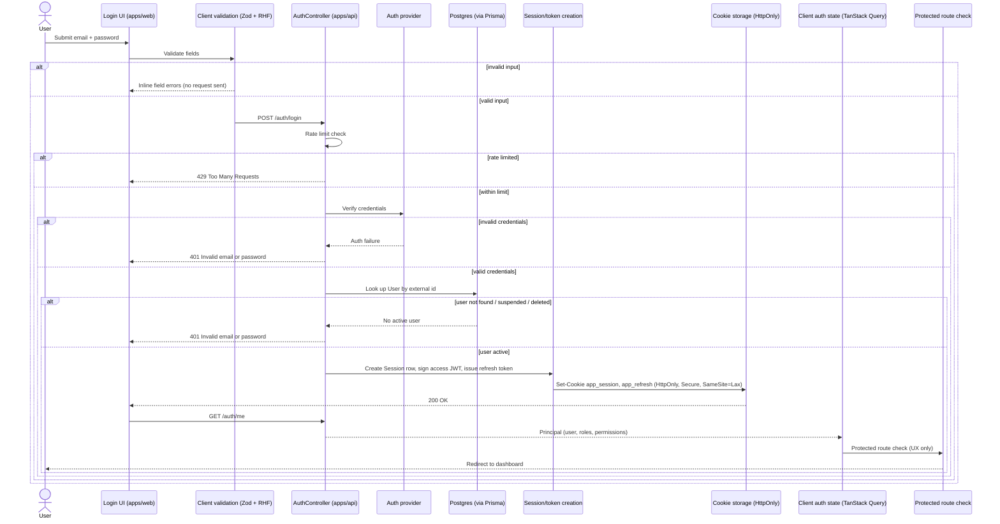
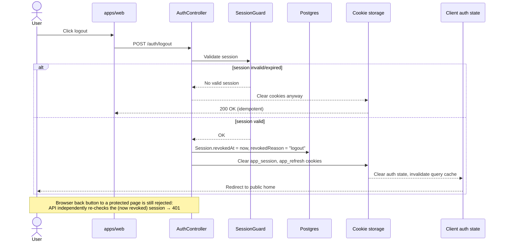
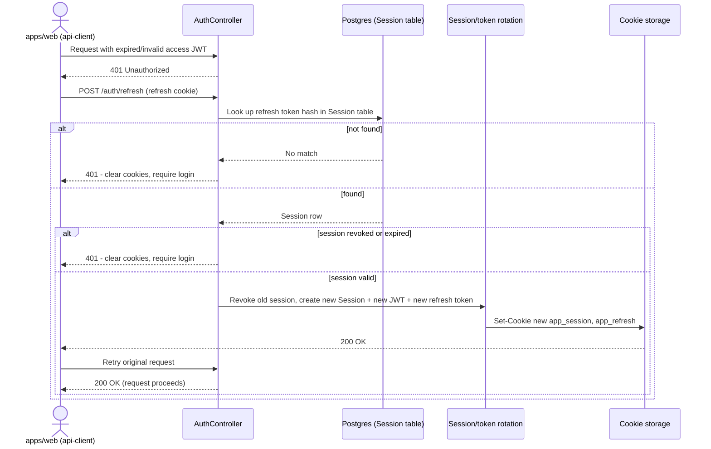
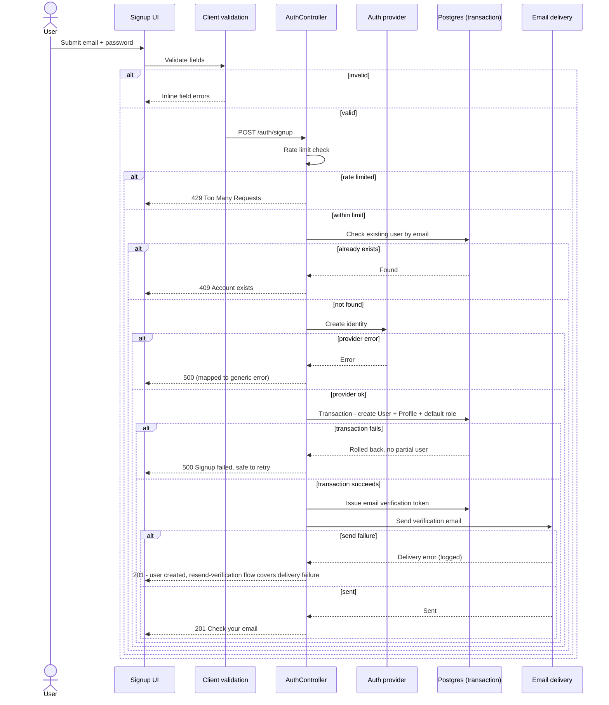
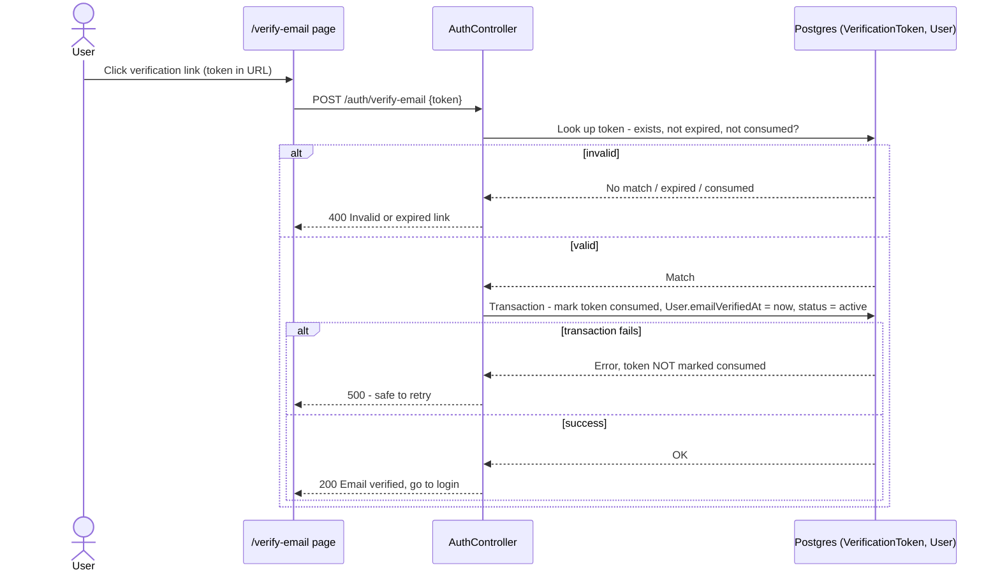
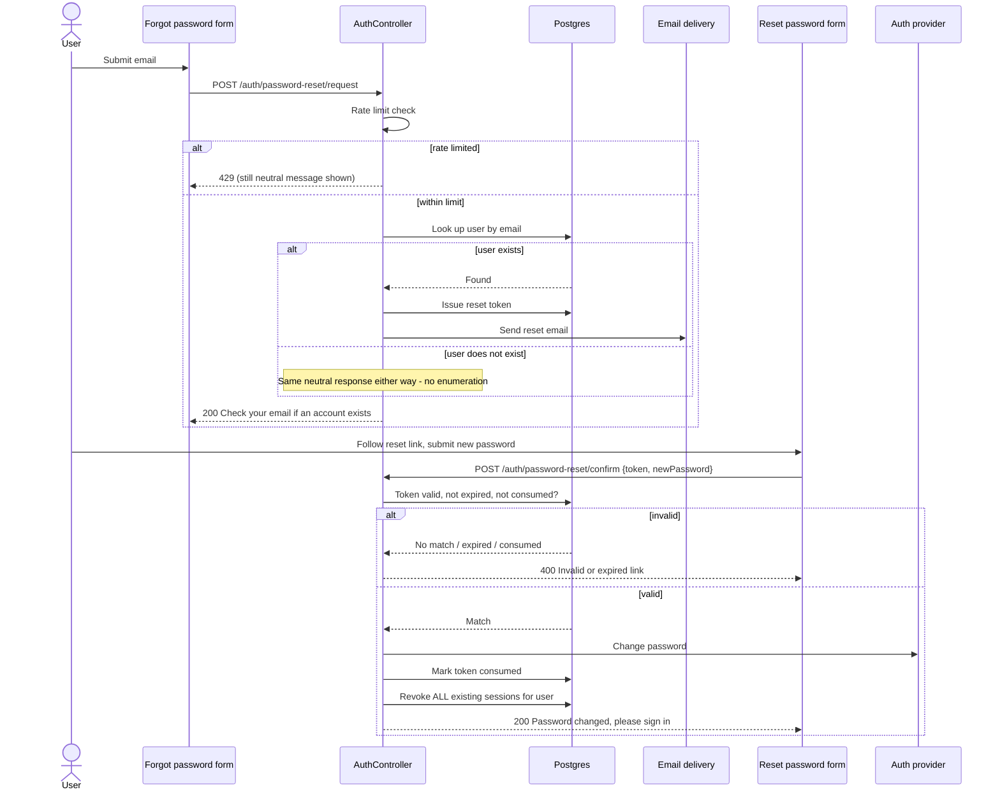
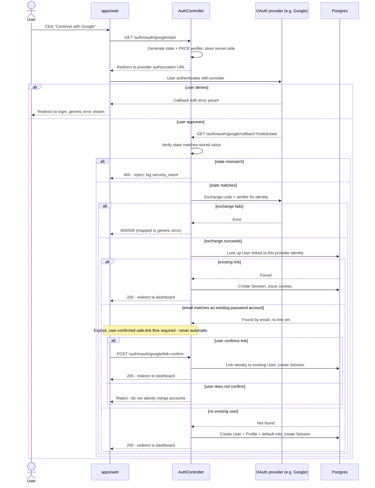
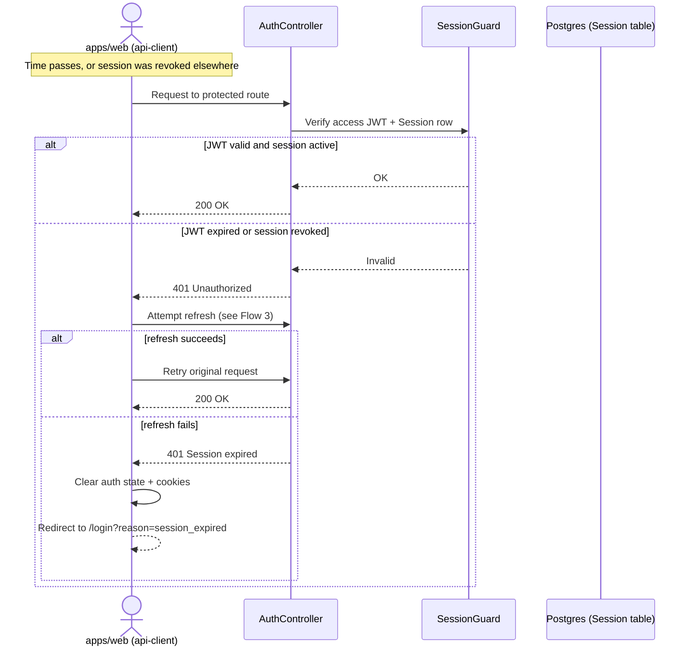

# docs/auth/FLOWS.md

Phase 1 deliverable. Sequence diagrams for every lifecycle in the "Lifecycle tracing"
checklist, each tracing User → Login UI → Validation → Authentication request →
Backend/Auth provider → Database → Session/token creation → Storage → Auth state →
Application state → Protected route → User dashboard, with every failure branch and the
HTTP status code it produces. These complement the flowcharts in
[ARCHITECTURE.md](ARCHITECTURE.md) §2 (decision-oriented) with the actor-level call
sequence (who calls whom, in what order). No application code was written to produce
this document — see [ARCHITECTURE.md](ARCHITECTURE.md) and `AUTH_RULES.md`.

## 1. Login lifecycle

## 2. Logout lifecycle

## 3. Refresh lifecycle

## 4. Signup lifecycle

## 5. Verification lifecycle

## 6. Password reset lifecycle

## 7. OAuth lifecycle (e.g. Google)

## 8. Session expiration lifecycle

